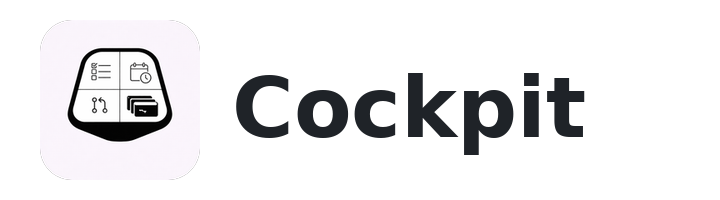
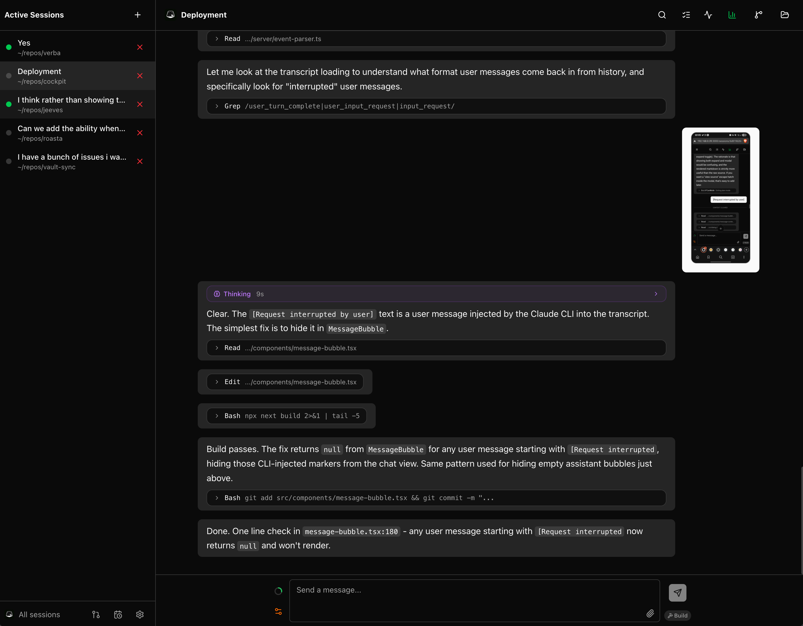
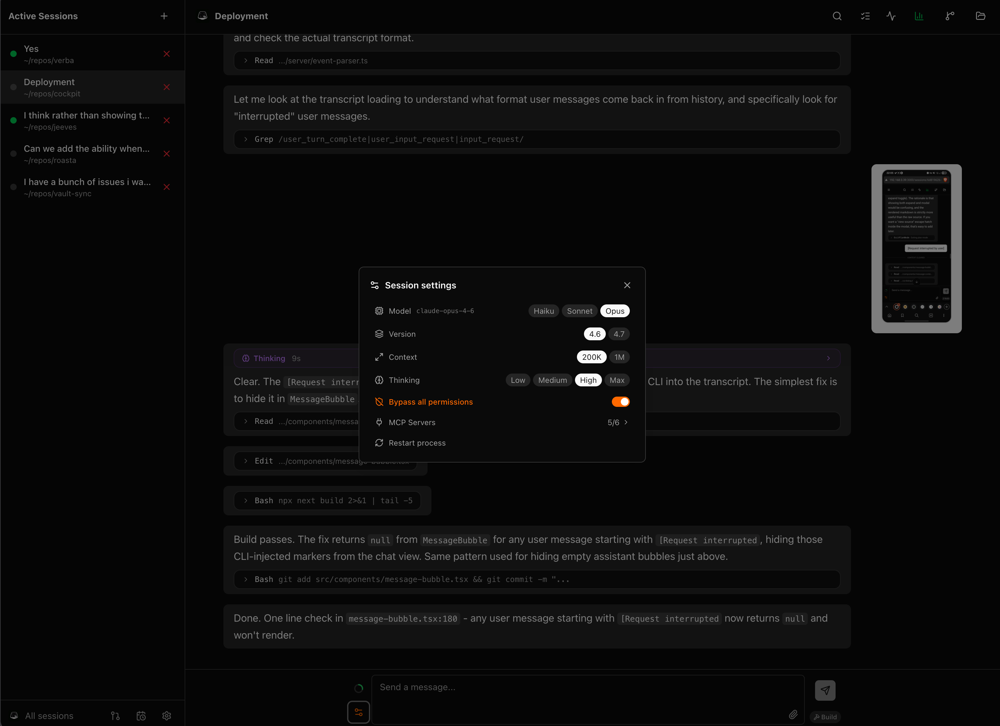
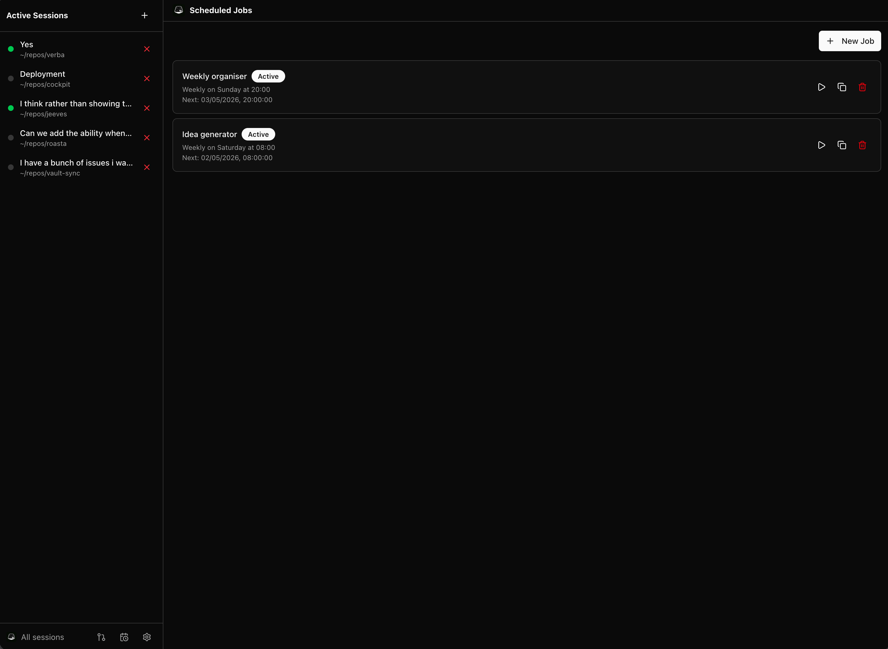
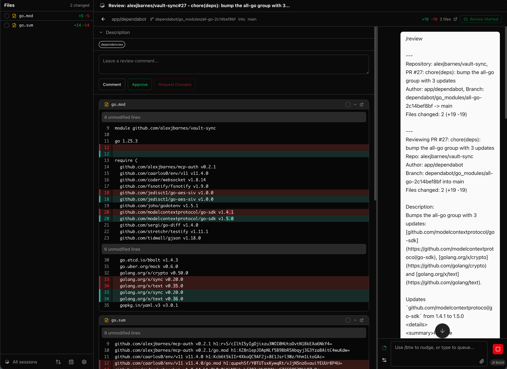
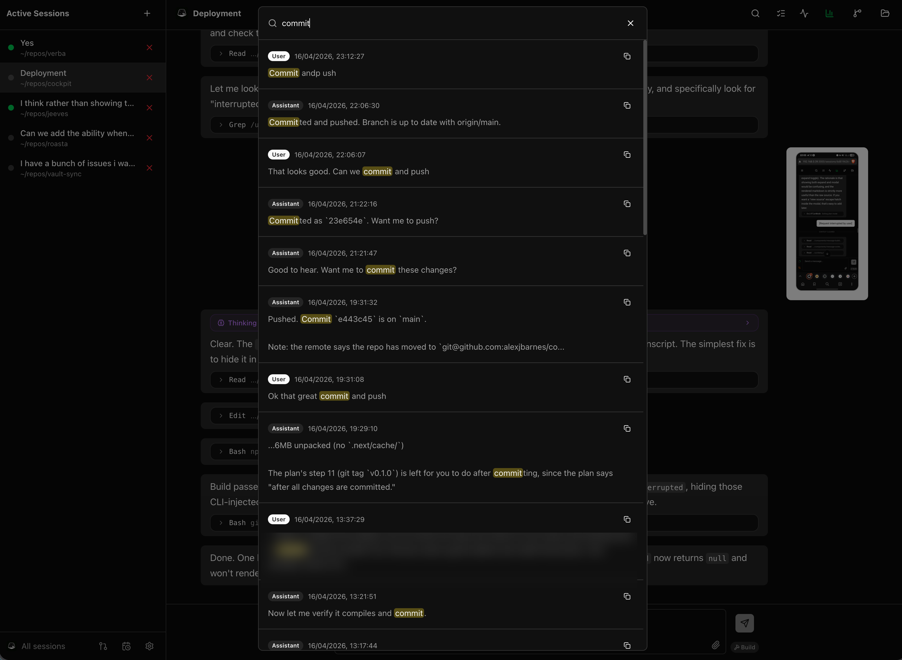
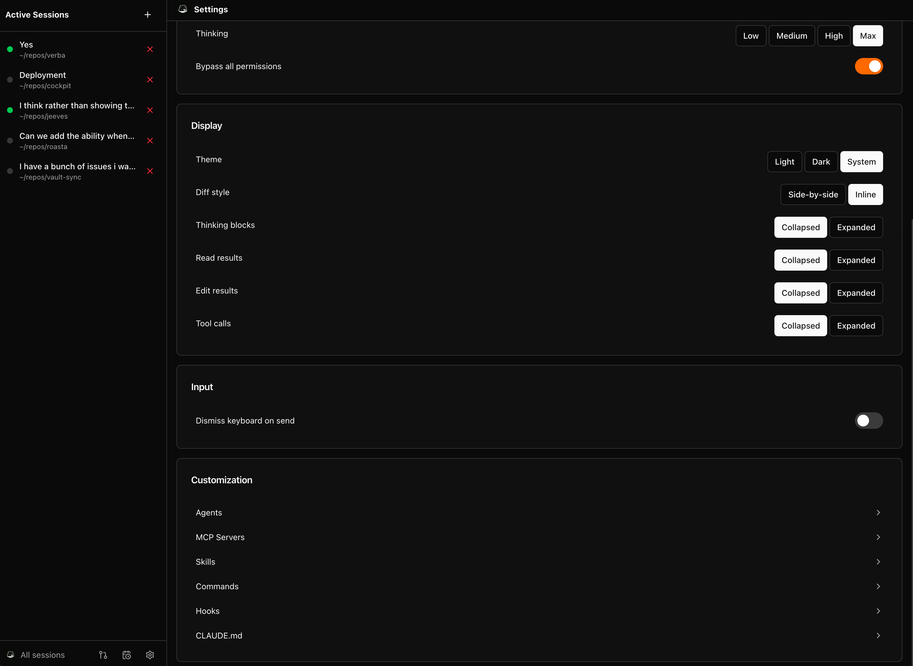
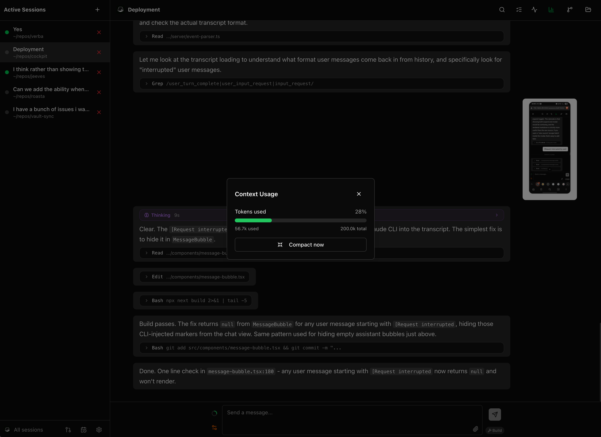
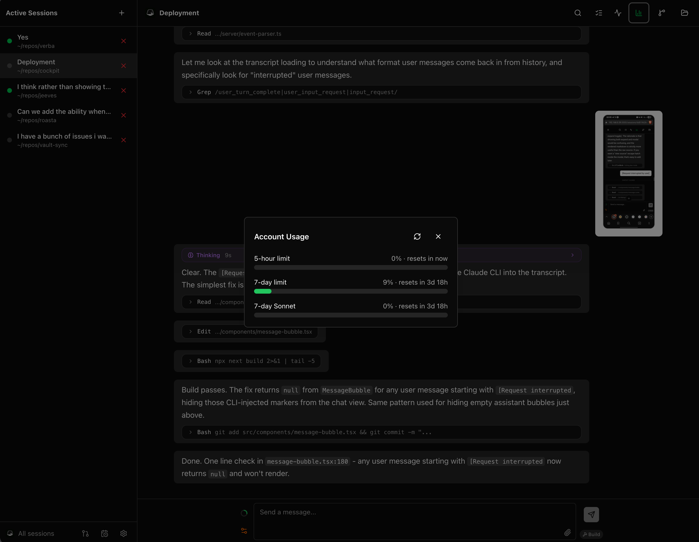

<p align="center">
  <picture>
    <source media="(prefers-color-scheme: dark)" srcset="public/banner-dark.png" />
    
  </picture>
</p>

<p align="center">Una interfaz web para Claude Code que lo libera de tu terminal.</p>

## ¿Por qué?

Claude Code es excelente. También es una aplicación de terminal. Una ventana, una máquina, solo en primer plano. Cockpit ejecuta el mismo motor como un servidor: las sesiones viven en el servidor, el navegador es solo un visor y cerrar tu portátil no detiene nada.

La arquitectura es simple: **navegador ↔ servidor Cockpit ↔ la CLI real de Claude Code**. No es una reimplementación del ciclo del agente, es la CLI real, impulsada en modo headless o a través de un pseudo-terminal.

De esto se derivan cuatro cosas:

1. **Claude Code en tu teléfono.** Responde desde un tren, una cocina, o cualquier lugar donde se abra un navegador. La sesión que iniciaste en tu escritorio está allí mismo, sigue funcionando.
2. **Múltiples sesiones ejecutándose a la vez.** Cambia entre proyectos sin tener que manejar paneles de tmux. Los indicadores de estado muestran qué sesiones están trabajando, esperando o inactivas, y la vista de chat se mantiene unida a través de `/clear` para que los hilos largos conserven su historial visual completo.
3. **Cualquier modelo a través del ciclo agéntico completo.** El uso de herramientas, la edición de archivos y los prompts de permisos funcionan igual, ya sea que el modelo sea Claude, algo gratuito del catálogo de OpenRouter o DeepSeek. Los proveedores que solo usan el formato de protocolo de OpenAI pasan por un proxy de traducción integrado, incluidas las trazas de pensamiento.
4. **Agentes no atendidos en un horario programado.** No es un envoltorio de cron: cada trabajo es una ejecución aislada con su propio modelo, sus propias listas permitidas de herramientas y servidores MCP, y un límite de tiempo, reportando resultados a través de una bandeja de entrada o directamente a tu teléfono.

Dentro de una sesión: un diseño con pestañas y paneles divididos que contiene el chat, un visor de diffs para cambios de código (dividido o en línea), un visor de archivos con resaltado de sintaxis y un terminal integrado. Los mensajes enviados mientras Claude está trabajando se colocan en cola a nivel del servidor y se entregan cuando termina el turno, y `/btw` responde una pregunta rápida lateral en un Claude separado sin herramientas, sin interrumpir la ejecución. Además, búsqueda global en todas las sesiones (Ctrl+Shift+F), historial de prompts buscable con la flecha hacia arriba y aprobaciones en modo plan cuando Claude propone uno. La barra lateral mantiene sesiones, revisiones activas, cambios de archivos y árboles de archivos en secciones colapsables.

**Reúne todos los proveedores bajo un mismo techo.** Conexión con un solo clic a OpenRouter, OpenCode Zen y DeepSeek, o apunta Cockpit a cualquier punto de conexión compatible con Anthropic que tengas, cada uno con sus propias credenciales. Conecta OpenRouter y todo su catálogo está a un clic de distancia, incluidos modelos gratuitos, con precios en vivo y una insignia de GRATIS visible directamente en el selector. Filtra la lista hasta los pocos que realmente usas, luego elige el modelo por sesión y por trabajo programado, con contextos de 200K o 1M y un nivel de razonamiento. Cada proveedor rastrea su propio gasto o saldo en el panel de uso.

Cada sesión se ejecuta en modo **Stream** (JSON headless, el predeterminado) o en modo **PTY**, que impulsa la CLI interactiva dentro de un pseudo-terminal. PTY existe por una razón: los planes de suscripción facturan el uso programático y el interactivo de manera diferente, y PTY mantiene las sesiones de Cockpit en el lado interactivo. Cámbialo por sesión.

También se encarga de cosas que normalmente editas a mano: agentes, habilidades (skills), ganchos (hooks), servidores MCP, complementos (plugins) y la memoria CLAUDE.md. Todo editable desde la interfaz, o de forma conversacional: el Asistente integrado de Cockpit es una sesión de Claude conectada al propio servidor MCP de Cockpit, por lo que "crear un trabajo nocturno que..." se convierte en un cambio de configuración que puedes aprobar o rechazar.

Las revisiones de PR son un flujo de primer orden. Elige una organización, elige un repositorio, elige un PR. Cockpit lee el diff a través de la CLI de GitHub e inicia una sesión de Claude limitada a este. El diff en un lado, el chat en el otro. Las revisiones activas se fijan en la barra lateral junto a tus sesiones. La vida diaria con git también está aquí: revisa el árbol de trabajo, genera un mensaje de commit, confirma y publica sin salir del navegador.

Los **trabajos programados** son donde el servidor demuestra su valor. Dale un prompt y un horario (una expresión cron o un intervalo simple) y delimita su alcance estrictamente: su propio modelo y nivel de razonamiento, las herramientas exactas y servidores MCP que le están permitidos tocar, un presupuesto de tiempo de ejecución, y cuánto tiempo conservar las transcripciones. Se ejecuta sin supervisión, y cada ejecución se renderiza como una transcripción de sesión normal que puedes abrir después. Los resultados llegan a una bandeja de entrada, con opción de push a Telegram o ntfy.sh, para que un aumento de dependencias nocturno o un paso de triaje de PR matutino llegue a tu teléfono mientras estás lejos de la máquina.

Ejecútalo en tu portátil como lo harías con la TUI. O ejecútalo en un servidor doméstico y accede a él desde tu teléfono. La misma interfaz en ambos casos.

## Capturas de pantalla

<p align="center">
  <a href="docs/screenshots/chat-view.png"></a>
  <a href="docs/screenshots/session-settings.png"></a>
</p>

<p align="center">
  <a href="docs/screenshots/scheduled-jobs.png"></a>
  <a href="docs/screenshots/pr-review.png"></a>
</p>

<p align="center">
  <a href="docs/screenshots/message-search.png"></a>
  <a href="docs/screenshots/settings.png"></a>
</p>

<p align="center">
  <a href="docs/screenshots/context-usage.png"></a>
  <a href="docs/screenshots/account-usage.png"></a>
</p>

## Inicio rápido

```sh
npx @alexjbarnes/cockpit
```

O instala globalmente:

```sh
npm install -g @alexjbarnes/cockpit
cockpit
```

El registro de inicio imprime URLs de conexión utilizables (locales y de red). Abre http://localhost:3001 y establece una contraseña en la primera ejecución.

## Requisitos previos

- Node.js >= 20
- [Claude Code CLI](https://www.npmjs.com/package/@anthropic-ai/claude-code) instalado y en PATH
- Una clave API de Anthropic configurada para Claude Code
- [GitHub CLI](https://cli.github.com/) (`gh`) autenticada, si deseas revisiones de PR

Probado en Linux y macOS. Windows no verificado.

## Configuración

| Variable | Descripción | Predeterminado |
|---|---|---|
| `PORT` | Puerto en el que el servidor escucha | `3001` |
| `HOST` | Dirección de enlace | `0.0.0.0` |
| `COCKPIT_RESET_PASSWORD` | Establecer en `true` para restablecer la contraseña en el próximo inicio | `false` |
| `COCKPIT_CONFIG_DIR` | Ubicación de la configuración de Cockpit (contraseña, proveedores, valores predeterminados, trabajos, bandeja de entrada) | `~/.cockpit` |
| `CLAUDE_CONFIG_DIR` | Configuración de Claude y transcripciones que lee Cockpit | `~/.claude` |
| `COCKPIT_DEBUG` | Establecer en `1` para escribir un registro de depuración estructurado | sin establecer |

Establecer `COCKPIT_CONFIG_DIR` y `CLAUDE_CONFIG_DIR` juntos te permite ejecutar instancias aisladas una al lado de la otra. Consulta [Configuración](docs/settings.md#environment-variables) para la lista completa.

## Acceso remoto

Cockpit se une a `0.0.0.0` por defecto. En la máquina host, abre `http://localhost:3001`. Desde otros dispositivos en la misma LAN, usa la IP local del host (el registro de inicio imprime URLs utilizables).

Para acceder a Cockpit desde fuera de tu LAN, prefiere [Tailscale](https://tailscale.com/) sobre el reenvío de puertos. Tailscale asigna una IP privada a cada dispositivo en una red plana sin abrir puertos del router ni exponer el servidor públicamente.

Para restringir Cockpit solo a la máquina host, establece `HOST=127.0.0.1`.

## Documentación

- [Sesiones](docs/sessions.md): chat, modos de ejecución, diseño con pestañas, barra lateral, adjuntos, modo plan, diffs, vista de archivos, historial de prompts, tareas, búsqueda, vinculación de sesiones
- [Proveedores de modelos](docs/providers.md): gateways integrados de OpenRouter, OpenCode Zen y DeepSeek, proveedores personalizados compatibles con Anthropic, el proxy de traducción de OpenAI, tamaños de contexto, ranuras de modelos y uso por proveedor
- [Terminal integrada](docs/terminal.md): shell en el navegador con temas y soporte móvil
- [Revisiones de PR](docs/pr-reviews.md): navegación y sesiones de revisión de PR de GitHub
- [Trabajos programados](docs/scheduled-jobs.md): ejecuciones de Claude Code impulsadas por cron
- [Configuración](docs/settings.md): autenticación, modelos, proveedores, temas, notificaciones, bandeja de entrada, actualizaciones, agentes, habilidades, ganchos, servidores MCP, CLAUDE.md

## Desarrollo

```sh
npm install
npm run dev
```

Las pruebas unitarias se ejecutan con `npx vitest run`. El [suite de integración](docs/integration-tests.md) impulsa la CLI real de Claude Code contra una API de Anthropic simulada a través de Playwright, por lo que el comportamiento en tiempo de ejecución está demostrado en lugar de asumido. Issues y PRs bienvenidos.

## Licencia

Apache 2.0
