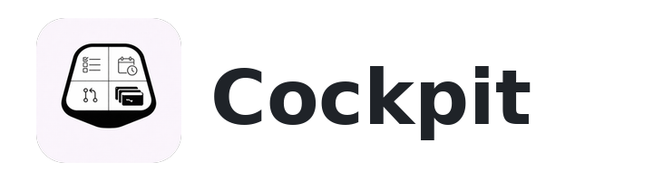
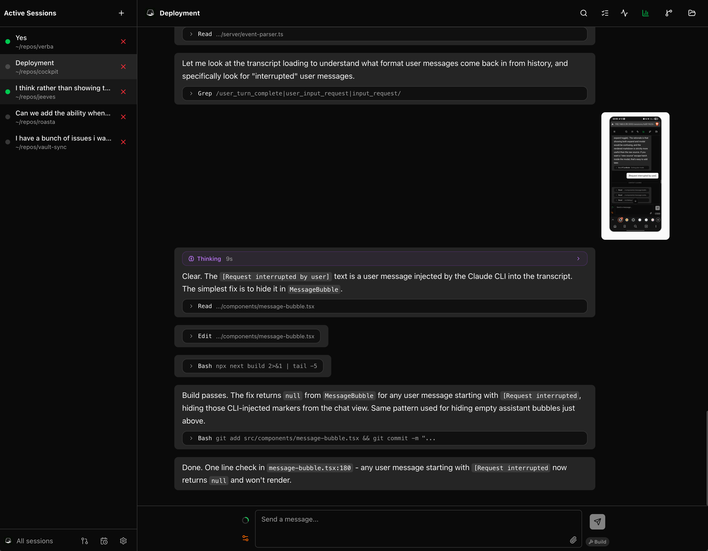
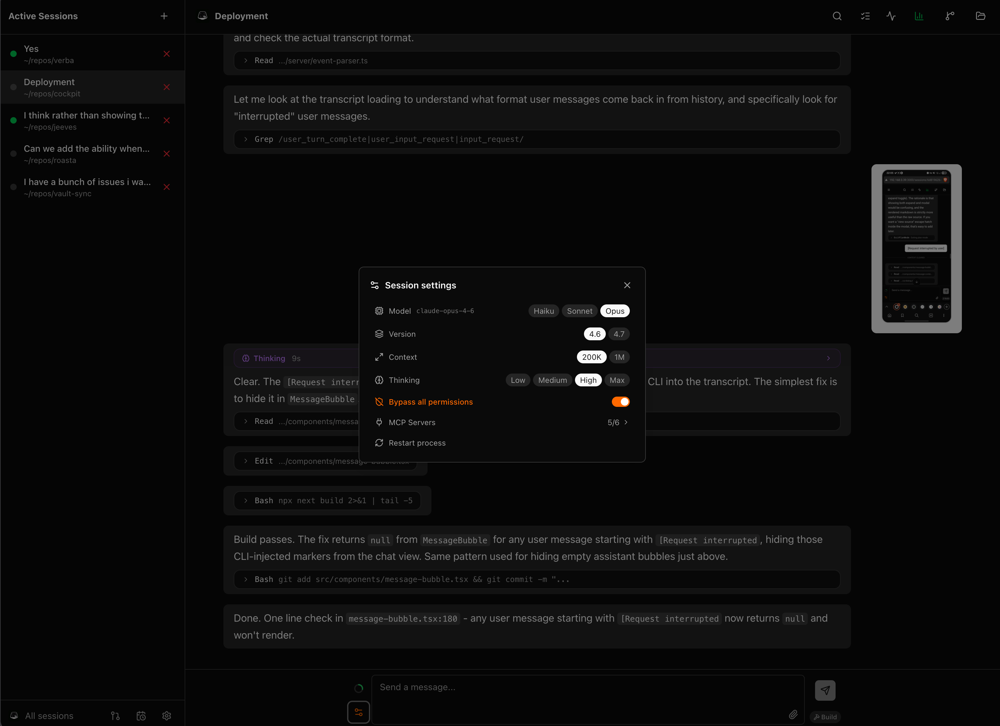
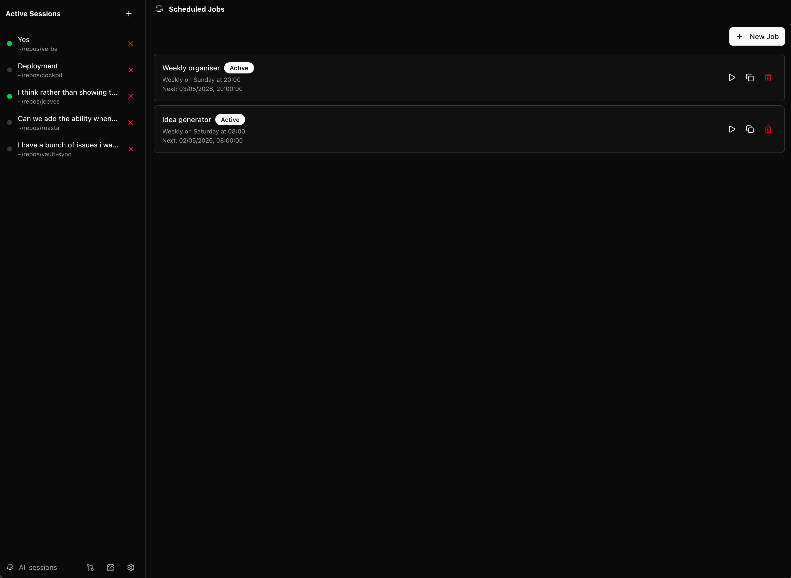
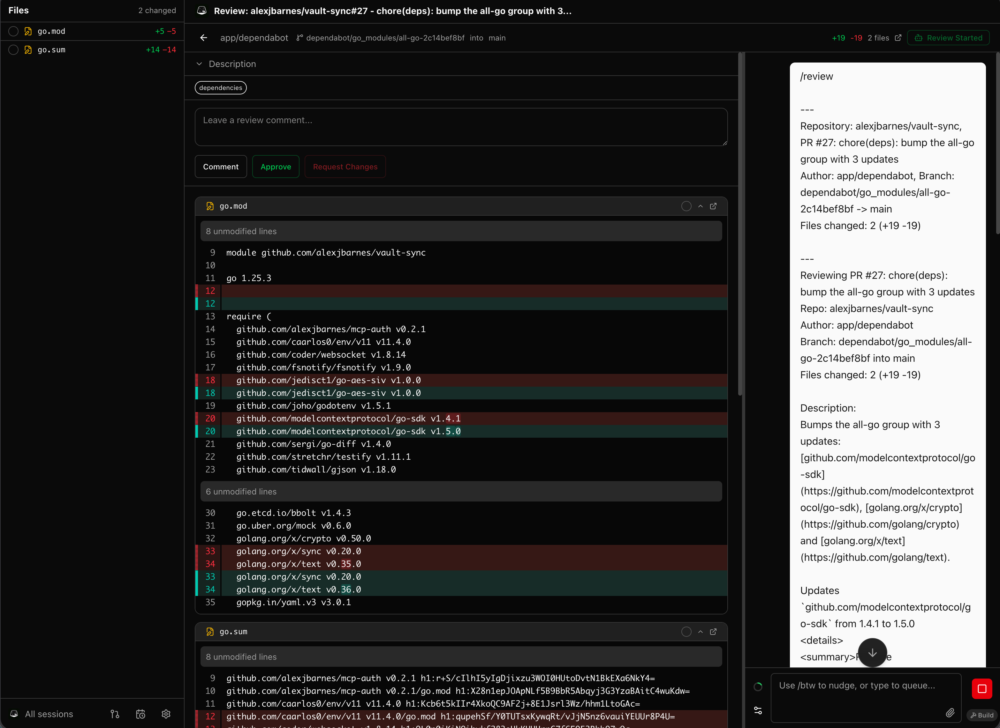
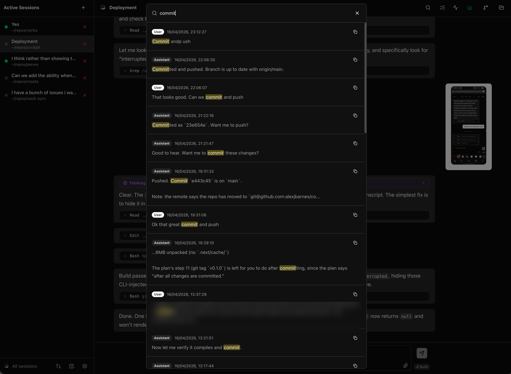
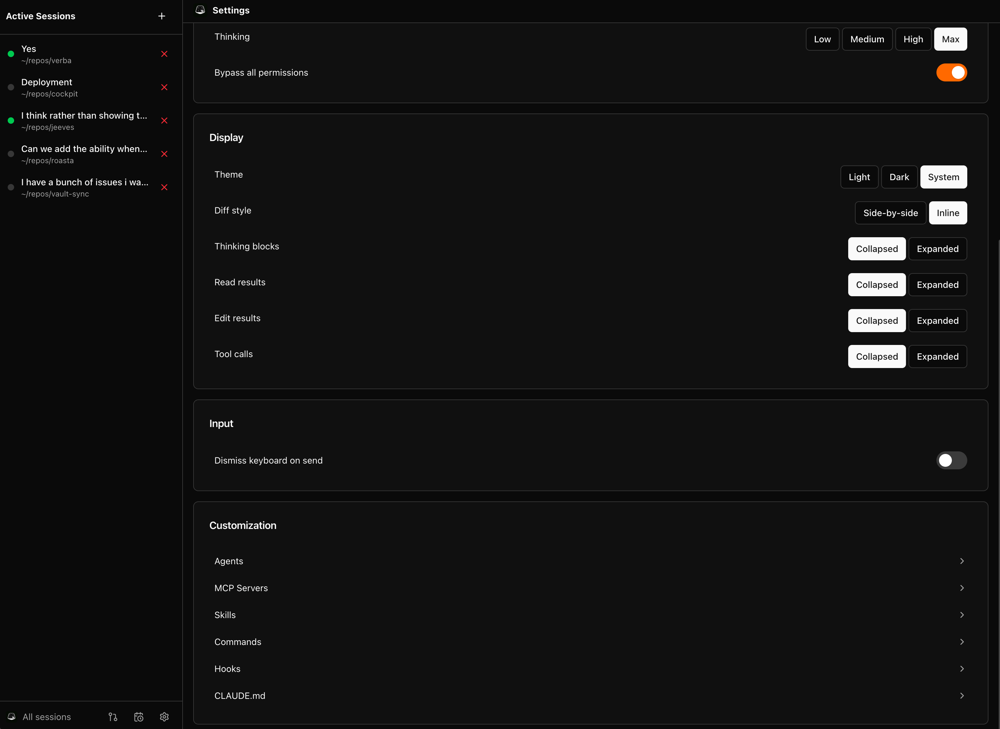
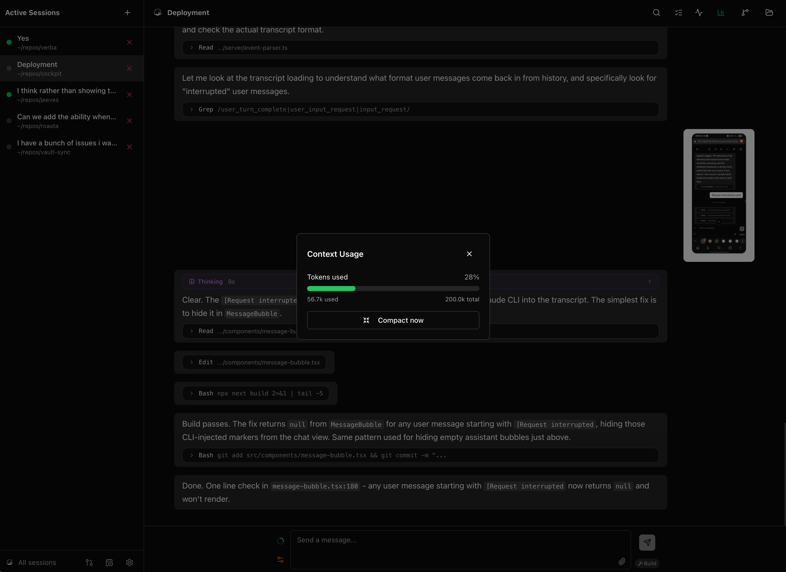
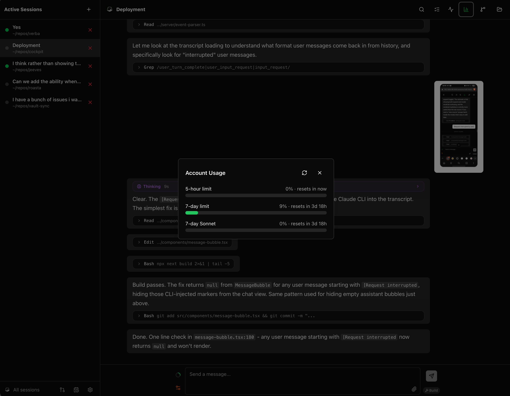

<p align="center">
  <picture>
    <source media="(prefers-color-scheme: dark)" srcset="public/banner-dark.png" />
    
  </picture>
</p>

<p align="center">A web UI for Claude Code that frees it from your terminal.</p>

## Why

Claude Code is great. It's also a terminal app. One window, one machine, foreground only. Cockpit takes the same engine and runs it as a server you reach from any browser.

Three things follow:

1. **Claude Code on your phone.** Reply to your assistant from a train, a kitchen, anywhere a browser opens.
2. **Many Claude Code sessions running at once.** Switch between projects without juggling tmux panes. Sessions live on the server, so closing the browser does not kill them. The chat view stitches across `/clear` so long threads keep their full visual history.
3. **Cron-driven Claude Code.** Schedule a prompt, walk away. Each run produces a transcript that renders the same as a live session.

Inside a session: a tabbed, split-pane layout holding the chat, a diff viewer for code changes (split or inline), a file viewer with syntax highlighting, and an embedded terminal. Plus global search across all sessions (Ctrl+Shift+F), searchable prompt history on the up arrow, and plan-mode approvals when Claude proposes a plan. The sidebar shows collapsible sections for sessions, reviews, file changes, and file trees, with status beacons so you can tell at a glance which sessions are working, waiting, or idle.

**Bring your own models.** Built-in Haiku, Sonnet, and Opus, or point Cockpit at any Anthropic-compatible endpoint, a proxy, a gateway, or your own deployment, each with its own credentials and model list. Choose the model per session and per scheduled job, with a 200K or 1M context selector. Each session runs in Stream mode (headless) or PTY mode, which drives the real Claude Code CLI through a pseudo-terminal.

It also takes care of things you usually hand-edit: agents, skills, hooks, MCP servers, CLAUDE.md memory. All editable from the UI.

PR reviews are a first-class flow. Pick an org, pick a repo, pick a PR. Cockpit reads the diff via the GitHub CLI and starts a Claude session scoped to it. Diff on one side, chat on the other. Active reviews pin to the sidebar alongside your sessions.

**Scheduled jobs** turn Claude Code into a cron worker. Give one a prompt and a schedule (a cron expression or a simple interval) and scope it tightly: its own model and thinking level, the exact tools and MCP servers it is allowed to touch, a run-time budget, how long to keep transcripts. It runs unattended, and each run renders as a normal session transcript you can open later. Results land in an inbox, with optional push to Telegram or ntfy.sh, so a nightly dependency bump or a morning PR-triage pass reaches your phone while you are away from the machine.

Run it on your laptop the way you'd run the TUI. Or run it on a home server and reach it from your phone. Same UI either way.

## Screenshots

<p align="center">
  <a href="docs/screenshots/chat-view.png"></a>
  <a href="docs/screenshots/session-settings.png"></a>
</p>

<p align="center">
  <a href="docs/screenshots/scheduled-jobs.png"></a>
  <a href="docs/screenshots/pr-review.png"></a>
</p>

<p align="center">
  <a href="docs/screenshots/message-search.png"></a>
  <a href="docs/screenshots/settings.png"></a>
</p>

<p align="center">
  <a href="docs/screenshots/context-usage.png"></a>
  <a href="docs/screenshots/account-usage.png"></a>
</p>

## Quick start

```sh
npx @alexjbarnes/cockpit
```

Or install globally:

```sh
npm install -g @alexjbarnes/cockpit
cockpit
```

The startup log prints usable connection URLs (local and network). Open http://localhost:3001 and set a password on first run.

## Prerequisites

- Node.js >= 20
- [Claude Code CLI](https://www.npmjs.com/package/@anthropic-ai/claude-code) installed and on PATH
- An Anthropic API key configured for Claude Code
- [GitHub CLI](https://cli.github.com/) (`gh`) authenticated, if you want PR reviews

Tested on Linux and macOS. Windows is unverified.

## Configuration

| Variable | Description | Default |
|---|---|---|
| `PORT` | Port the server listens on | `3001` |
| `HOST` | Bind address | `0.0.0.0` |
| `COCKPIT_RESET_PASSWORD` | Set to `true` to reset password on next startup | `false` |
| `COCKPIT_CONFIG_DIR` | Cockpit config location (password, providers, defaults, jobs, inbox) | `~/.cockpit` |
| `CLAUDE_CONFIG_DIR` | Claude config and transcripts Cockpit reads | `~/.claude` |
| `COCKPIT_DEBUG` | Set to `1` to write a structured debug log | unset |

Setting `COCKPIT_CONFIG_DIR` and `CLAUDE_CONFIG_DIR` together lets you run isolated instances side by side. See [Settings](docs/settings.md#environment-variables) for the full list.

## Remote access

Cockpit binds to `0.0.0.0` by default. On the host machine, open `http://localhost:3001`. From other devices on the same LAN, use the host's local IP (the startup log prints usable URLs).

To reach Cockpit from outside your LAN, prefer [Tailscale](https://tailscale.com/) over port forwarding. Tailscale gives every device a private IP on a flat network without opening router ports or exposing the server publicly.

To restrict Cockpit to the host machine only, set `HOST=127.0.0.1`.

## Documentation

- [Sessions](docs/sessions.md): chat, runtime modes, tabbed layout, sidebar, attachments, plan mode, diffs, file view, prompt history, todos, search, session linking
- [Model providers](docs/providers.md): built-in and custom Anthropic-compatible providers, context sizes, model slots
- [Embedded terminal](docs/terminal.md): in-browser shell with themes and mobile support
- [PR reviews](docs/pr-reviews.md): GitHub PR browsing and review sessions
- [Scheduled jobs](docs/scheduled-jobs.md): cron-driven Claude Code runs
- [Settings](docs/settings.md): auth, models, providers, themes, notifications, inbox, updates, agents, skills, hooks, MCP servers, CLAUDE.md

## Development

```sh
npm install
npm run dev
```

## License

Apache 2.0
